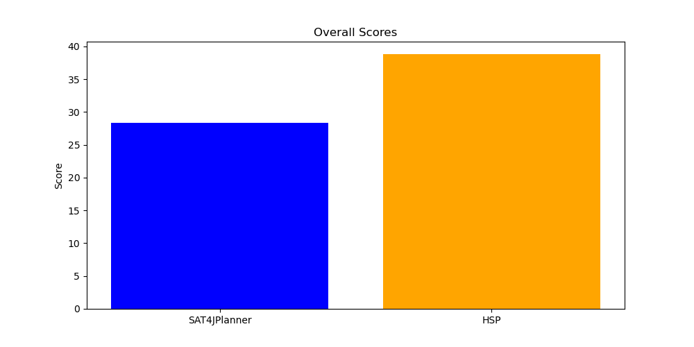

# Comparison of SAT4JPlanner and HSP

| Solver | Problem | Time Spent (s) | Steps |
|--------|---------|----------------|-------|
| SAT4JPlanner | pddl/logistics/problems/p01.pddl | 0.31 | 31 |
| HSP | pddl/logistics/problems/p01.pddl | 0.22 | 20 |
| SAT4JPlanner | pddl/logistics/problems/p02.pddl | 0.30 | 29 |
| HSP | pddl/logistics/problems/p02.pddl | 0.32 | 19 |
| SAT4JPlanner | pddl/logistics/problems/p03.pddl | 0.34 | 16 |
| HSP | pddl/logistics/problems/p03.pddl | 0.17 | 15 |
| SAT4JPlanner | pddl/logistics/problems/p04.pddl | 0.78 | 32 |
| HSP | pddl/logistics/problems/p04.pddl | 0.82 | 27 |
| SAT4JPlanner | pddl/logistics/problems/p05.pddl | 0.31 | 31 |
| HSP | pddl/logistics/problems/p05.pddl | 0.33 | 17 |
| SAT4JPlanner | pddl/logistics/problems/p06.pddl | 0.22 | 8 |
| HSP | pddl/logistics/problems/p06.pddl | 0.12 | 8 |
| SAT4JPlanner | pddl/logistics/problems/p07.pddl | 0.46 | 32 |
| HSP | pddl/logistics/problems/p07.pddl | 1.08 | 26 |
| SAT4JPlanner | pddl/logistics/problems/p08.pddl | 0.42 | 15 |
| HSP | pddl/logistics/problems/p08.pddl | 0.16 | 14 |
| SAT4JPlanner | pddl/logistics/problems/p09.pddl | 0.44 | 32 |
| HSP | pddl/logistics/problems/p09.pddl | 0.55 | 25 |
| SAT4JPlanner | pddl/logistics/problems/p10.pddl | 0.41 | 31 |
| HSP | pddl/logistics/problems/p10.pddl | 0.56 | 24 |
| SAT4JPlanner | pddl/blocks/problems/p01.pddl | 0.10 | 8 |
| HSP | pddl/blocks/problems/p01.pddl | 0.07 | 6 |
| SAT4JPlanner | pddl/blocks/problems/p02.pddl | 0.11 | 10 |
| HSP | pddl/blocks/problems/p02.pddl | 0.08 | 10 |
| SAT4JPlanner | pddl/blocks/problems/p03.pddl | 0.12 | 8 |
| HSP | pddl/blocks/problems/p03.pddl | 0.08 | 6 |
| SAT4JPlanner | pddl/blocks/problems/p04.pddl | 0.25 | 16 |
| HSP | pddl/blocks/problems/p04.pddl | 0.08 | 12 |
| SAT4JPlanner | pddl/blocks/problems/p05.pddl | 0.15 | 14 |
| HSP | pddl/blocks/problems/p05.pddl | 0.09 | 10 |
| SAT4JPlanner | pddl/blocks/problems/p06.pddl | 0.37 | 16 |
| HSP | pddl/blocks/problems/p06.pddl | 0.08 | 16 |
| SAT4JPlanner | pddl/blocks/problems/p07.pddl | 0.21 | 14 |
| HSP | pddl/blocks/problems/p07.pddl | 0.10 | 12 |
| SAT4JPlanner | pddl/blocks/problems/p08.pddl | 0.31 | 12 |
| HSP | pddl/blocks/problems/p08.pddl | 0.09 | 10 |
| SAT4JPlanner | pddl/blocks/problems/p09.pddl | 1.25 | 30 |
| HSP | pddl/blocks/problems/p09.pddl | 0.26 | 20 |
| SAT4JPlanner | pddl/blocks/problems/p10.pddl | 3.92 | 26 |
| HSP | pddl/blocks/problems/p10.pddl | 0.26 | 20 |
## Logistics Results

## Blocks Results

## Overall Results

