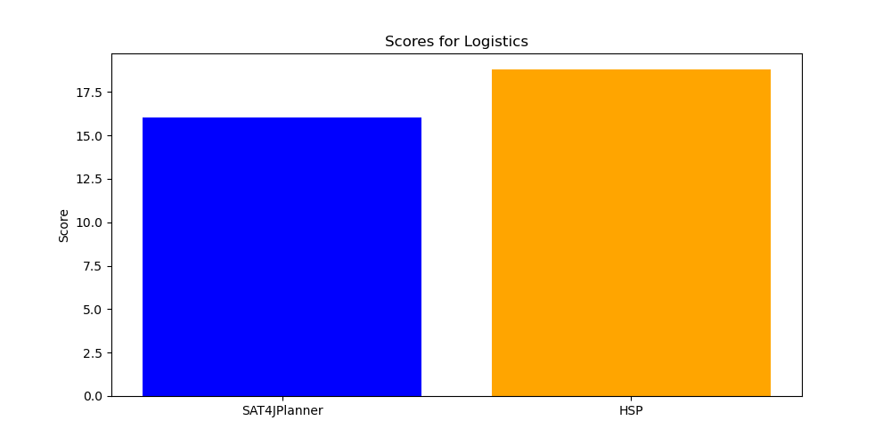
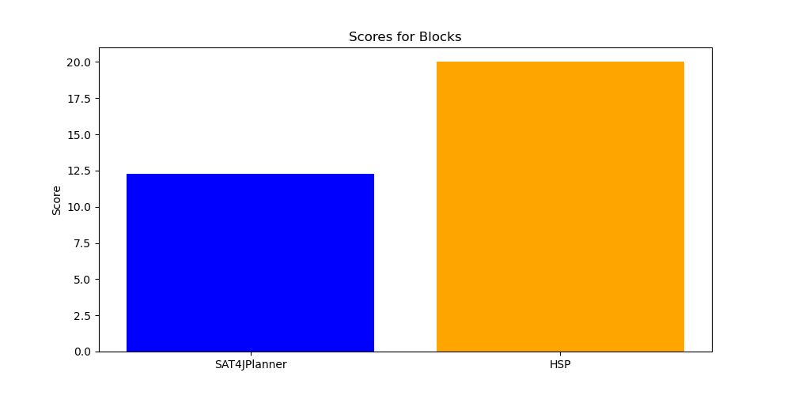
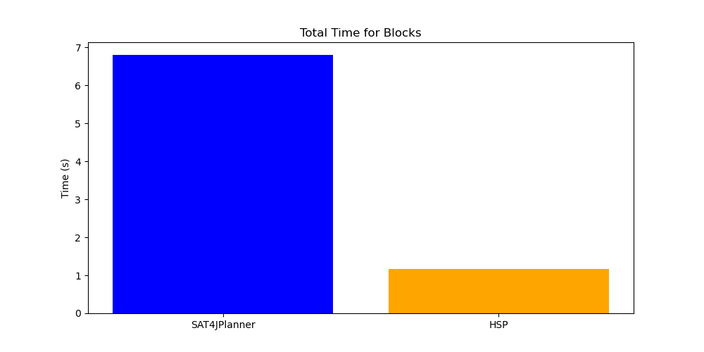
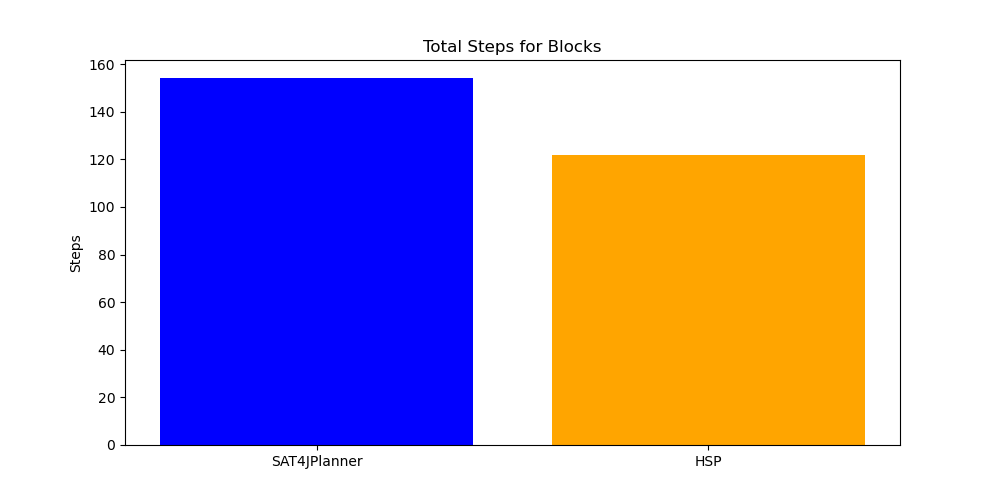
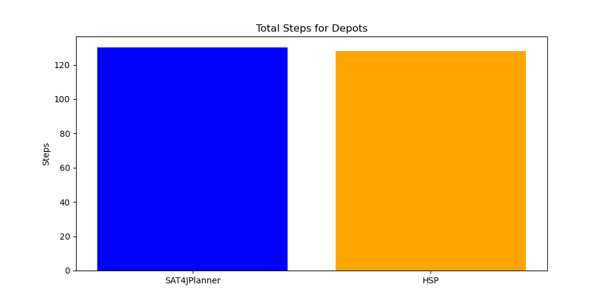

# Comparison of SAT4JPlanner and HSP

## All data is based on 5 problems of each domain.

| Solver | Problem | Time Spent (s) | Steps |
|--------|---------|----------------|-------|
| SAT4JPlanner | pddl/logistics/problems/p01.pddl | 0.14 | 13 |
| HSP | pddl/logistics/problems/p01.pddl | 0.24 | 20 |
| SAT4JPlanner | pddl/logistics/problems/p02.pddl | 0.14 | 13 |
| HSP | pddl/logistics/problems/p02.pddl | 0.43 | 19 |
| SAT4JPlanner | pddl/logistics/problems/p03.pddl | 0.12 | 13 |
| HSP | pddl/logistics/problems/p03.pddl | 0.21 | 15 |
| SAT4JPlanner | pddl/logistics/problems/p04.pddl | 0.15 | 13 |
| HSP | pddl/logistics/problems/p04.pddl | 1.12 | 27 |
| SAT4JPlanner | pddl/logistics/problems/p05.pddl | 0.14 | 13 |
| HSP | pddl/logistics/problems/p05.pddl | 0.39 | 17 |
| SAT4JPlanner | pddl/blocks/problems/p01.pddl | 0.11 | 9 |
| HSP | pddl/blocks/problems/p01.pddl | 0.06 | 6 |
| SAT4JPlanner | pddl/blocks/problems/p02.pddl | 0.13 | 6 |
| HSP | pddl/blocks/problems/p02.pddl | 0.06 | 10 |
| SAT4JPlanner | pddl/blocks/problems/p03.pddl | 0.11 | 8 |
| HSP | pddl/blocks/problems/p03.pddl | 0.06 | 6 |
| SAT4JPlanner | pddl/blocks/problems/p04.pddl | 0.12 | 8 |
| HSP | pddl/blocks/problems/p04.pddl | 0.09 | 12 |
| SAT4JPlanner | pddl/blocks/problems/p05.pddl | 0.12 | 9 |
| HSP | pddl/blocks/problems/p05.pddl | 0.11 | 10 |
| SAT4JPlanner | pddl/gripper/problems/p01.pddl | 0.12 | 7 |
| HSP | pddl/gripper/problems/p01.pddl | 0.09 | 11 |
| SAT4JPlanner | pddl/gripper/problems/p02.pddl | 0.12 | 9 |
| HSP | pddl/gripper/problems/p02.pddl | 0.33 | 17 |
| SAT4JPlanner | pddl/gripper/problems/p03.pddl | 0.13 | 11 |
| HSP | pddl/gripper/problems/p03.pddl | 1.15 | 23 |
| SAT4JPlanner | pddl/gripper/problems/p04.pddl | 0.15 | 13 |
| HSP | pddl/gripper/problems/p04.pddl | 5.48 | 29 |
| SAT4JPlanner | pddl/gripper/problems/p05.pddl | 0.14 | 15 |
| HSP | pddl/gripper/problems/p05.pddl | 45.28 | 35 |
| SAT4JPlanner | pddl/depots/problems/p01.pddl | 0.16 | 18 |
| HSP | pddl/depots/problems/p01.pddl | 0.14 | 10 |
| SAT4JPlanner | pddl/depots/problems/p02.pddl | 0.23 | 22 |
| HSP | pddl/depots/problems/p02.pddl | 0.26 | 15 |
| SAT4JPlanner | pddl/depots/problems/p03.pddl | 0.23 | 26 |
| HSP | pddl/depots/problems/p03.pddl | 1.57 | 29 |
| SAT4JPlanner | pddl/depots/problems/p04.pddl | 0.24 | 30 |
| HSP | pddl/depots/problems/p04.pddl | 6.88 | 30 |
| SAT4JPlanner | pddl/depots/problems/p05.pddl | 0.26 | 34 |
| HSP | pddl/depots/problems/p05.pddl | 140.46 | 44 |
## Logistics Results

## Blocks Results

## Gripper Results

## Depots Results

## Overall Results

